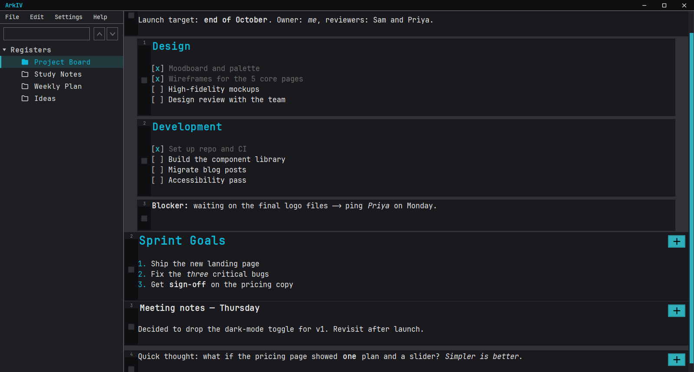
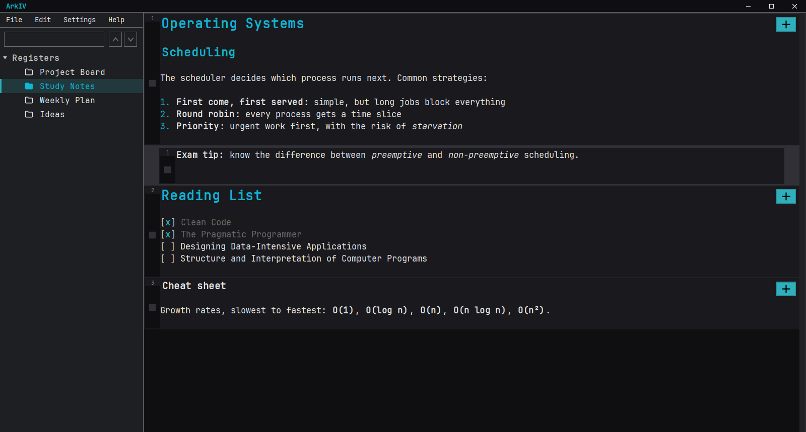
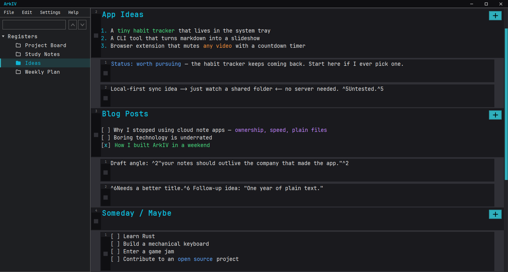

<h1 align="center">ArkIV</h1>

  Markdown-native desktop organizer built from scratch in Java Swing.

  

  

  

## What is it?

ArkIV is a personal task and note organizer that lives entirely on your local machine. It was originally created to act as a *to do list manager*, but overtime it evolved with many new features, making it my daily desktop organizer to manage my various ideas and plans. Although the App's UI and layout is original and based on my ideas, most of the App features are inspired from *Obsidian* and *NeoVim*.

I primarily use ArkIV for managing:
- Watchlists
- Future Plans
- Ideas and Inspirations
- Important Dates
- Git and terminal commands

With these use of various Markdown features I have implemented the App does a great job at managing them and make it look visually appealing.
However, since there is no strict format on how the data has to typed in, the user gets complete freedom to utilize it however convenient.

## Highlights

- **Registers**: separate workspaces, each backed by its own JSON file, switchable with `Ctrl+Tab`.
- **Nested entries**: sub-entries, collapsible parents, and keyboard reordering.
- **Live Markdown**: headings, bold, italic, lists and task lists render right in the card, with the syntax markers faded out instead of hidden.
- **Editor niceties**: hotstrings, key binds, Obsidian-style selection wrapping, and JetBrains-style caret navigation.
- **Custom dark UI**: rounded dialogs, themed scrollbars and checkboxes, all hand-painted in Swing with JetBrains Mono.
